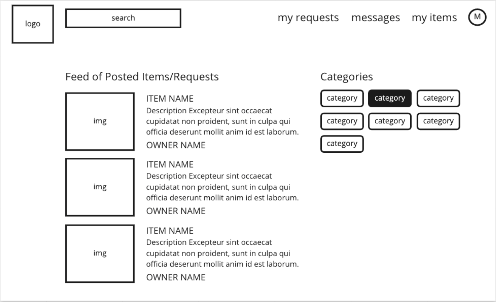
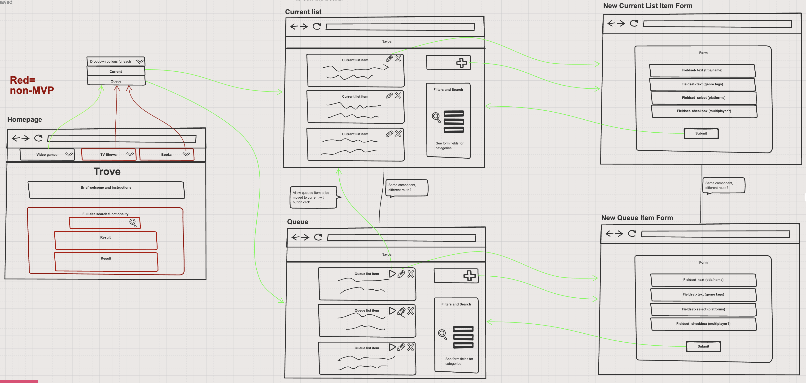

# Cider Falls Park Web Site

You have been contracted to build an interactive web site for a public park in your county - Cider Falls. Here are the features that the administrator of the park wants to have.

## Setup

Your mentors will provide a Github Classroom link that will create the Github repository. Make sure that the team follows the guidance provided in the [Github Workflow Guides](https://nashville-software-school.github.io/github-workflow/) during this project.

Once the team's repository has been made and everyone has joined the Github Classroom team, you will start with the [Begin a Project With Starter Code](https://nashville-software-school.github.io/github-workflow/START_REMOTE.html) process.

## Destinations

There are six major destinations in the park. This application will display information about the park areas, their services, and about the guests. We will only track first and last name for each guest.

1. In the northeast section, there is the **Chamfort River** that supports rafting, canoeing, and fishing.
1. In the northern section, there is the **Lost Wolf Hiking Trail** that supports hiking, picnicking, and rock climbing.
1. In the northwest section, the main attraction is the **Lodge**, but there is also a hotel, and a restaurant. This area supports lodging, parking, information, and picnicking.
1. In the southwest section, there is the **Gander River**, which is a natural preserve, so it only supports fishing and hiking.
1. In the southern section, the main attraction is the  **Campgrounds**. Ther eis also the office park, and children play areas. This area supports information, lodging, and parking.
1. In the southeast section, there is the **Pine Bluffs Trails**, a vast network of trails for all levels of hikers. On the beginner trail, there are food vendors. This area support hiking, picnicking, and zip lines.

* Each section should have a title _(e.g. Lost Wolf Hiking Trail)_.
* Each section should display the services is supports _(e.g. hiking)_.

## General Layout

The administrator wants the park logo and park name at the top of the page. She wants the main phone number, email address, and street address at the bottom of the page.

All of the areas should be displayed in the proper location in a layout of two rows, and three columns.

The areas grid should be in the main content area of the page, and left aligned.

The names of all current park guests should be listed in the main content area of the page, and right aligned.

## Wireframes

Given these requirements by the park administrator, use your wireframing tool to make a low fidelity layout of the project. A low fidelity wireframe is where you will start any new project. It is crucial that you understand the following.

1. What are the main visual components the user will see.
2. What is the layout and positioning for the visual components.
3. What content will be in each visual component.
4. If a visual component is interactive (i.e. can be clicked on) what will happen when it is clicked.

All of this information will impact how you develop your application. Therefore, it must be decided before you start coding, because it _guides_ how you will code.

## Examples

Ok, enough talk, time to see what a wireframe looks like.

### Low Fidelity Wireframe

Here is one that was developed by one of your predecessors for her capstone project. Note how the elements are just boxes or text. Nothing extra included, like colors, styling, or animations to confuse you.

### Low Fidelity Interaction Wireframe

When your application has multiple views that the customer can navigate to, creating a wireframe for each of those views, and then showing how the user is directed to each is critical.

Here is another example by one of your predecessors.

Note how each view of her application was clearly defined with low fidelity. Then, for each interactive element, arrows were used to indicate which view would be presented if clicked.

## Professional Description

Please read this "[Exploring Wireframes](https://mentormate.medium.com/exploring-wireframes-is-simple-better-6c6cb7c8d483)" article for a brief overview of how user experience (UX) professionals use low fidelity wireframes to effective guide development of a software application.

## Getting Started

Here are some free, popular wireframing tools used by students in past cohorts.

1. [Sketchboard](https://sketchboard.io/)
1. [Figma](https://www.figma.com/)
1. [Miro](https://miro.com/)

Sign up for one of these tools since you are about to create your very first wireframe for Martin's Aquarium.
